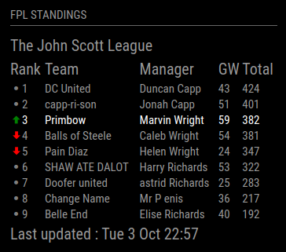

# MMM-FPL-Standings



This a module for the [MagicMirror](https://github.com/MichMich/MagicMirror/tree/develop).   This module shows the current Fantasy Premier League (FPL) standings for a private league.

## How do I find my FPL league ID?
You can find your FPL ID on the FPL site once logged in.

You can’t find it via the FPL app but if you navigate to the FPL website itself and ‘Pick Team’ tab, you’ll find ‘Gameweek History’ on the right under your team name and details such as overall points and rank etc.  Navigate to where it lists the Leagues and Cups, click the league you are interested in and the URL in the address bar should look something like this https://fantasy.premierleague.com/leagues/123456/standings/c.  The league id here is '123456'.

## Installation
```
cd ~/MagicMirror/modules
git clone https://github.com/MarvinAWright/MMM-FPL-Standings
cd MMM-FPL-Standings
npm install
```

## Config
The entry in `config.js` can include the following options:

| Property   | Description                                                                                                                                              |
|------------|----------------------------------------------------------------------------------------------------------------------------------------------------------|
| `leagueId` | **Mandatory** The id of the private league you would like to show the stangings for, see above how to get your your league id.<br><br>**Type:** `string` |
| `team`     | **Optional** If you would like to highlight a specific team in the league standings.<br><br>**Type:** `string`                                           |
| `interval` | **Optional** How often the standings are updated.<br><br>**Type:** `integer`<br>**Default value:** `600000 // 10 minutes`                                |

Here is an example of an entry in `config.js`
```
{
    module: 'MMM-FPL-Standings',
    position: 'bottom_left',
    header: 'FPL Standings',
    config: {
        interval: 600000,
        leagueId: '123456', // <-- Update this with your league id.
        team: '' // <-- Optional if you want to highlight a specific team in the league
    }
},
```

## Dependencies
- [request](https://www.npmjs.com/package/request) (installed via `npm install`)
